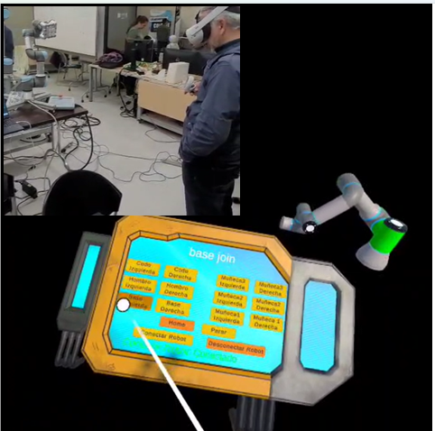
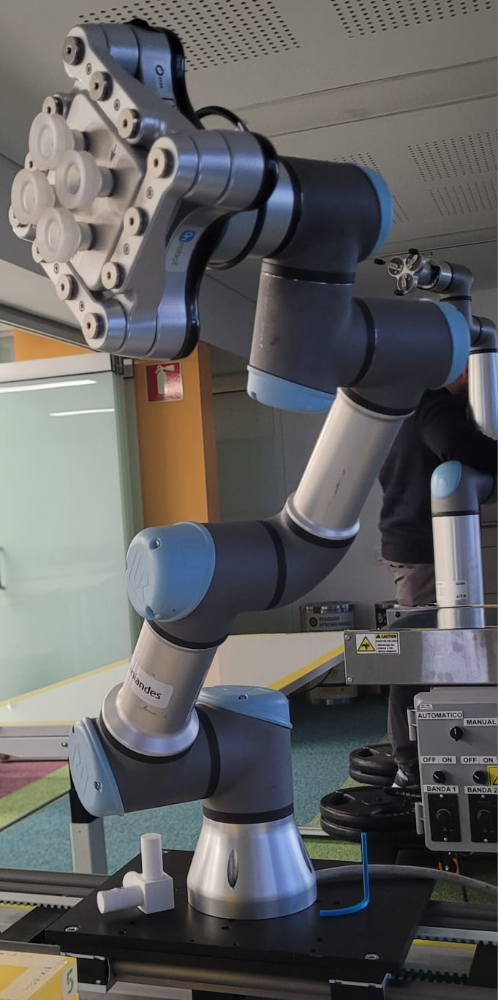
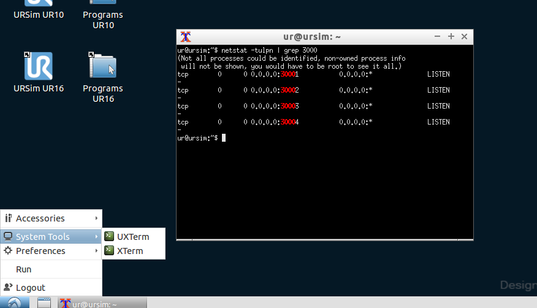
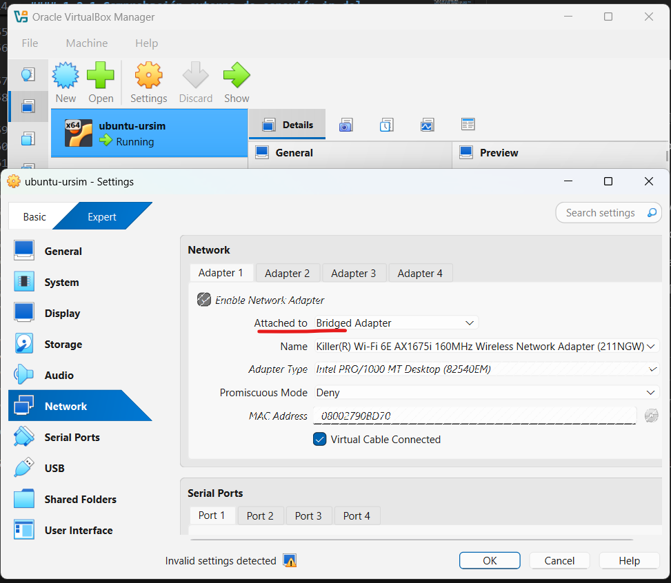
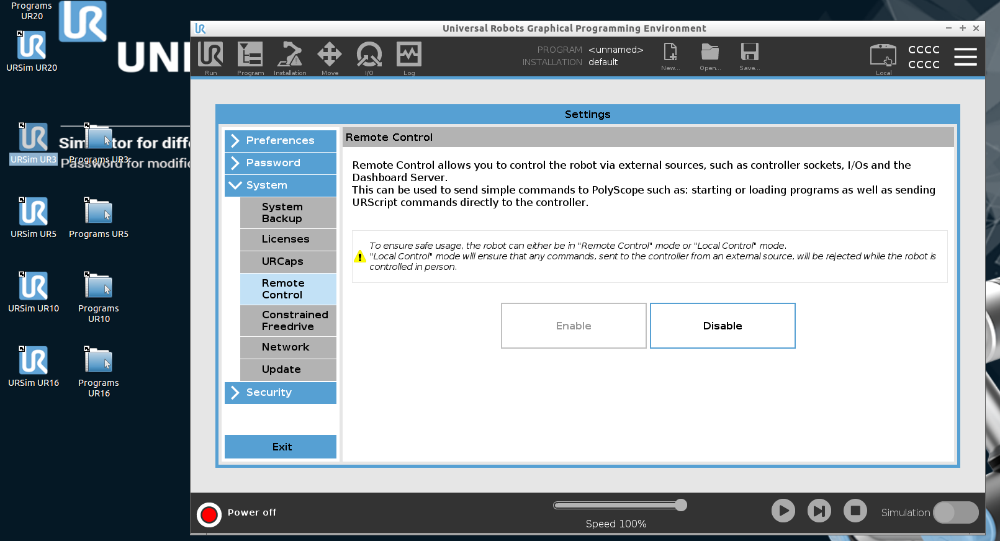
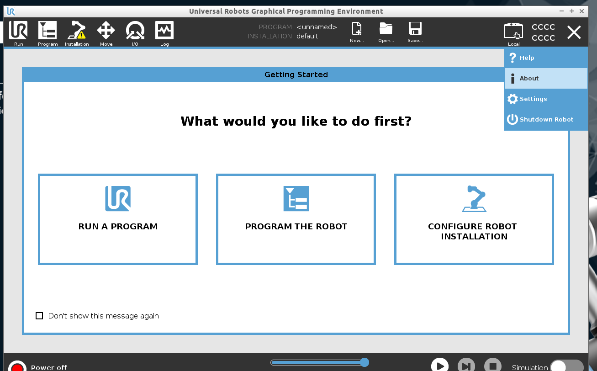
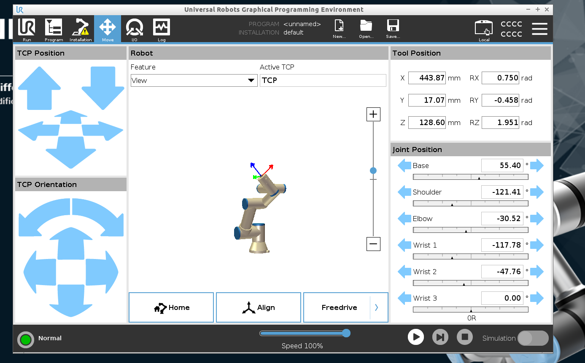
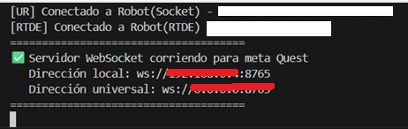
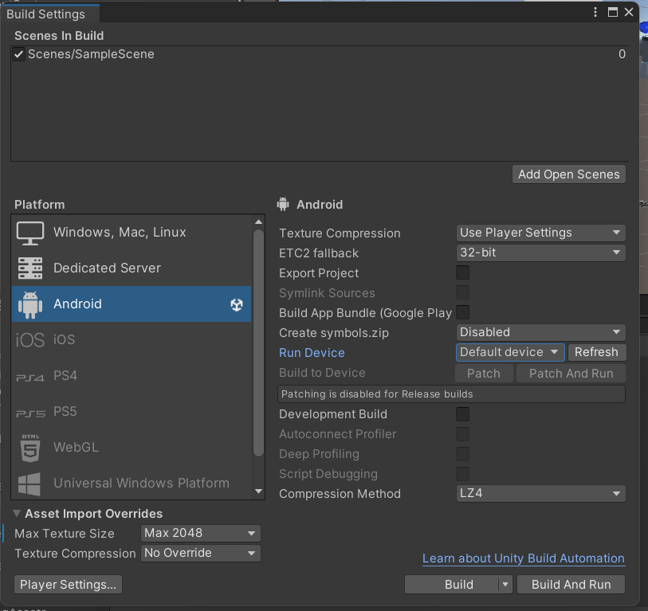

# Proyecto Unity + Meta Quest + UR Robots

Este proyecto integra **Unity (con passthrough en Meta Quest)** con robots UR (UR3, UR10 o UR30) o el simulador **URSim** a través de un servidor puente en Python.  


---

## 🚀 Recomendaciones

Pasos a tener en cuenta para poder ejecutar este proyecto:

1. **Instalar URSim (opcional si no se tiene robot real):**  
   - Se debe instalar en una máquina virtual con Linux.  
   - Permite simular un robot UR3, UR10 o UR30 en caso de no tener acceso a un robot real.  

2. **Instalar Python en el PC servidor:**  
   - Python debe estar instalado en el computador donde se ejecute el simulador o se conecte al robot real.  
   - Aun cuando se use conexión directa con el robot real, Python es necesario para correr el servidor puente que conecta **Unity (Meta Quest)** con el robot UR.  

3. **Configurar y compilar el proyecto Unity para Meta Quest:**  
   - El proyecto cuenta con passthrough, por lo tanto debe construirse un **APK**.  
   - Este APK se instala y ejecuta directamente en las gafas Meta Quest.  

4. **Configurar la red para la conexión:**  
   - En caso de conexión con robot real:  
     - El **robot UR**, el **PC servidor (Python)** y las **gafas Meta Quest** deben estar conectados a la **misma red**.  
   - En caso de usar el simulador URSim:  
     - Solo el **PC servidor (Python)** y las **gafas Meta Quest** necesitan estar conectados a la **misma red**.  

---

## 🛠️ Versiones recomendadas

Para asegurar compatibilidad y correcto funcionamiento del proyecto, se recomiendan las siguientes versiones de software y entornos:

- **Python:** 3.11.0  
- **Unity Editor:** 2022.3.10 (LTS)  
- **Máquina virtual:** Oracle VirtualBox con **Linux Ubuntu** (para instalar y correr URSim)  

---

## 🐍 Instalación de Python en ambiente propio

1. **Instalar Python 3.11 (si no lo tienes aún)**  
   - Descárgalo desde la página oficial:  
     👉 [Python 3.11.0 Download](https://www.python.org/downloads/release/python-3110/)  
   - Durante la instalación, asegúrate de marcar:  
     ✅ **Add Python 3.11 to PATH**  

2. **Crear un entorno virtual con esa versión**  
   En Windows, si se instaló como `py`:  
   ```bash
   py -3.11 -m venv .venv

3. **Activar el entorno virtual**  
   En Windows PowerShell:  
   ```bash
   .venv\Scripts\Activate

4. **Verificar version instalada en el proyecto**  
   En la terminal:  
   ```bash
   python --version
---

---

## 💻 (Opcional) Instalación máquina virtual URSim

El **URSim** es el simulador offline de **Universal Robots**, usado para programar y probar los cobots sin necesidad de un robot físico.  
Este software corre en **Linux**, por lo que para usarlo en entornos **Windows** es necesario ejecutarlo en una máquina virtual.  

### Pasos de instalación

1. **Descargar e instalar VirtualBox**  
   - 👉 [VirtualBox Download](https://www.virtualbox.org/)

2. **Descargar la imagen de máquina virtual con URSim**  
   Para este proyecto se recomienda la siguiente versión:  

   - **URSim (Non-Linux Offline Simulator)**  
     👉 [Descarga URSim](https://www.universal-robots.com/download)  
     Navegar a: `Downloads > Software > Non-Linux Offline simulator`  

   - **Offline Simulator - e-Series - URSim for non Linux 5.12.6 LTS**  
     👉 [URSim 5.12.6 LTS](https://www.universal-robots.com/download/software-e-series/simulator-non-linux/offline-simulator-e-series-ur-sim-for-non-linux-5126-lts/)

3. **Video recomendado para la configuracion de la imagen de URSim en la maquina virtual**  
   - Se aconseja ver el siguiente video explicativo paso a paso del proceso de configuración de URSim en VirtualBox.
     👉 [Descarga URSim](https://www.youtube.com/watch?v=3Ph8OQ_ZNkE&t=90s)  

4. **Ejecutar el simulador**  
   - Una vez creada la máquina virtual y configurada la imagen, se podrá acceder al sistema y ejecutar URSim como si se tratara de un robot real.  

---

## 🚀 Preparación y ejecución aplicación

### 1. **Comprobación conexión URsim y Python:**
   A continuación se indica la forma de conectar las gafas meta quest, ya sea con el simulador o con el robot real.

   Para esta comprobación se hara uso del código adjunto en el archivo `python-test-conecction-ur.py` que puede encontrar dentro de este mismo repositorio. Este código sirve para para comprobar la conexión real con el robot como el simulador, *solo debe cambiar la dirección ip dentro del archivo*
   **Nota**: Es importante que lleve al robot usando el polyscope a una posición indeterminada o en el simulador, ya que el programa proveido en este repositorio para la conexión lo que hace es enviar un comando para llevar al robot a la posición inicial y de esta manera podrá comprobar que efectivamente el robot ya esta listo para recibir los comandos de la aplicación del meta quest.


#### 1.1.Robot real
   Si tiene acceso al robot UR#, solo debe prender el mismo e ir a la sección about, verificar que el robot tenga conexión a la misma red que esta conetado el pc donde correra el script de python, y luego copiar y remplazar la ip del robot en el archivo script de prueba de conexión proveiod en este repositorio llamado `python-test-conecction-ur.py`. No olvide tener el robot en una posición indetermenida diferente a la del punto inicial.

   

   Una vez haya modificado la posición inicial del robot (puede ser usando la opción freedrive) y haya cambiado la ip en el programa, puede proceder a ejecutar el programa, y este llevara el robot de nuevo a la posición inicial, de esta manera ya habremos comprobado la conexión entre nuestro servidor de python y el robot.

#### 1.2 Simulador URSim
   En esta sección vamos a hacer uso del simulador, para comprobar la conexión con nuestro servidor de python.

##### 1.2.1 Comprobación externa de conexión ip del simulador
   Estas son algunas configuraciones que se debn hacer en al maquina virtual con URSim para poder acceder a la ip del simulador.
   - Antes de iNiciar la maquina virtual, seleccionar la imagen, luego click en Settings>Display>Graphics y configurar Controller: VBoxSVGA. ahora si arrancamos la maquina virtual de URSim.

   - Comprobamos que los puertos de URSim esten habilitados, estos puertos nos permitiran tanto enviar comandos como leer información proveniente del robot. Una vez dentro de la maquina virtual, vamos a inicio>system tool>UXTERM para abrir la terminal de comandos.
   Verificar que el puerto escucha URSim dentro de la VM
   ```bash
   netstat -tulpn | grep 3000
   ```
   Aqui comprobamos que los puertos estan escuchando y listos para ser utilizados.
   

   - Ahora debemos exponer la ip del simulador para que sea accesible desde fuera de la maquina virtual, para ello, obtenemos la ip dentro de la maquina virtual, en la terminal UXTERM, ingresamos el siguiente comando
   ```bash
   ip addr show
   ```

   Debe aparecer dentro como:
      **inet 10.0.2.15/24 brd 10.0.2.255 scope global eth0**

   👉 Esto significa que la IP de tu VM es: **10.0.2.15**

   Ahora verificar desde fuera de la VM la conexión con esta ip, vamos a una terminal de cmd y ejecutamos el comando: 
   ```
   ping 10.0.2.15
   ```

   Si la respuesta es la siguiente:

   > Pinging 10.0.2.15 with 32 bytes of data:
   > Request timed out.<br>
   > Request timed out.<br>
   > Request timed out.<br>
   > Request timed out.<br>
   > Ping statistics for 10.0.2.15:<br>
   >   Packets: Sent = 4, Received = 0, Lost = 4 (100% loss),
   
   Significa que la ip de la maquina virtual aún no esta expuesta. Esto normalmente pasa por la configuración de red de VirtualBox.

   🔹 10.0.2.15 es la IP típica cuando la VM está en modo NAT (por defecto en VirtualBox).

   En NAT, la VM puede salir a Internet, pero el host no puede entrar hacia ella → por eso no responde al ping.

   🔹 Para que el host (Windows) pueda comunicarse con la VM, se debe cambiar la red de la VM:

   * Adaptador puente (Bridged Adapter / Bridge):

   Pasos rápidos en VirtualBox:

   - Apaga la VM.
   - Ve a settings > Network
   - Cambia en "Adaptador 1"

      Enable Network Adapter

      Attached to: de NAT a Adaptador puente (Bridge Adapter)
   
   

   - Arranca de nuevo la VM de URSim y dentro revisa de nuevo la ip desde la terminal de UXTerm
   ```bash
   ip addr show
   ```
   Como resultado habra una ip asociada a tu pc host:
   **inet 192.168.0.6/24 brd 192.168.2.255 scope global eth**

   - Luego prueba desde tu host de nuevo, desde la terminal cmd con esa nueva IP haciendo ping.
   `ping 192.168.0.6`

   SI la respuesta del ping es la siguiente:

   > ping 192.168.0.6<br>
   > Pinging 192.168.0.6 with 32 bytes of data:<br>
   > Reply from 192.168.0.6: bytes=32 time=3ms TTL=64<br>
   > Reply from 192.168.0.6: bytes=32 time=1ms TTL=64<br>
   > Reply from 192.168.0.6: bytes=32 time=1ms TTL=64<br>
   > Reply from 192.168.0.6: bytes=32 time=1ms TTL=64<br>
   >
   > Ping statistics for 192.168.0.6:<br>
      Packets: Sent = 4, Received = 4, Lost = 0 (0% loss),<br>
   > Approximate round trip times in milli-seconds:<br>
      Minimum = 1ms, Maximum = 3ms, Average = 1ms

   Perfecto 🚀, ya tenemos conexión de nuestro host pc donde correra el script de python y nuestra maquina virtual con URSim, quiere decir que  puede comunicarse con la IP del Ursim (192.168.0.6) porque el ping responde.

##### 1.2.2 Comprobaciones y Ejecución del script con URSim
   Una vez ya comprobamos nuestra conexión del host con la ip del simulador dentro de la maquina virtual(VM), procedemos a usar la ip de nuestro robot URSim.

   1. Antes de correr el script, debemos abrir el simulador URSim.
      - 1.1. Iniciar la máquina virtual donde se instalo URSim y abri nuestro simulador por ejemplo URSim UR3.
      - 1.2. Se abrirá la interfaz gráfica de Polyscope (la misma que aparece en los robots físicos con la pantalla táctil).

   2. Poner el robot en modo "Remote Control"
      - 2.1. Dentro de Polyscope, ve al menú:
	      settings → System →Remote Control

      - 2.2. Activa el modo remoto (Enable). Esto permite que el robot (simulado) acepte comandos desde tu script Python.
      

   3. Verificar la dirección IP de URSim. Ir a la sección about, y tomar la ip que nos aparece y que se debe usar en el script Python.
   

   4. Confirmar conexión externa (host Windows)
     - 4.1. Ya desde Windows (donde tienes el script), asegúrate de que puedas hacer ping a la VM:	`ping 192.###.##.###`

   5. Verificar la configuración de la red de VirtualBox (usar Bridged Adapter).

   6. Mover el robot en el simulador en la pestaña "move" hacia una posición indeterminada.
   

   7. Finalmente cambiar en el script la ip del simualdor y luego proceder a correr el script. Si todo funciona correctamente, al correr el programa se vera mover el robot.

### 2. Conexión UR-Python-meta quest2

#### 2.1. Abrir nuestra aplicación de URSim o conectar el robot y en el archivo `UR_Unity_bridge_emergency.py` cambiamos la variable `ROBOT_IP` con la ip del robot o el URSim para conectarnos.

#### 2.2. Cuando se ejecuta el script nos va aparecer en la consola "Servidor WebSocket corriendo para meta Quest" y nos va aparecer la dirección local disponible para conectar nuestra aplicación de meta quest
   

#### 2.3. Abrir el proyecto en unity con la versión unity editor 2022.3.10 (LTS), copiamos la dirección del servidor `dirección local`, en la jerequía de nuestro proyecto seleccionamos el componente `WebSocketManager` y en el inspector pegamos nuestra dirección del servidor de python en la variable `Url`
   

#### 2.4. Nos aseguramos que no haya ning[un error de instalaci[on en la pesta;a edit>project settings> XR Plug-in management>project validation tanto para windows como para android.
   
#### 2.5. Configurar las gafas en la sección **build settings**, para quest2, 3 o pro. Asegurando que la escena este agregada y que la plataforma sea Android
   
   
#### 2.6. Una vez se hayan realizado las respectivas configuraciones, conectar el visor por usb, dentro del casco darle permisos y ya de esta manera procedemos a crear el build de nuestra aplicaciom o apk dando click en el botón **build and run** en la venta *bilding settings*.
   
#### 2.7. Una vez ya finaliza la creación del build, podemos colocarnos el visor y la aplicación ya estará ejecutandose.

   Finalmente ya podemos interactuar con nuestra aplicación de unity, nuestro servidor de python y la conexión con el robot UR o URSim

---

## 📌 Notas
- La carpeta `Library/` se auto construye cuando el proyecto se abre en unity

